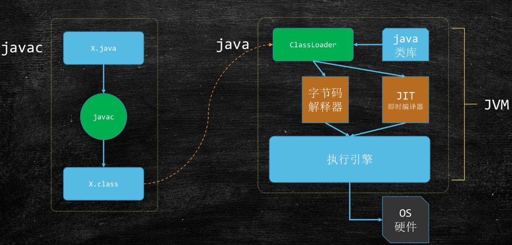
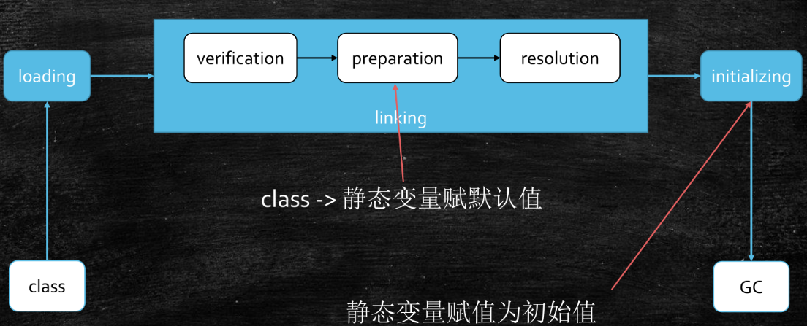
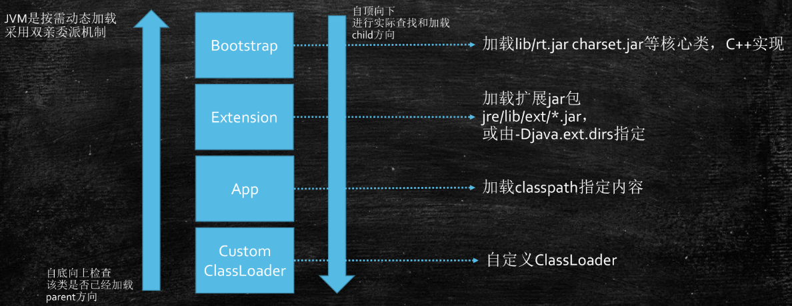
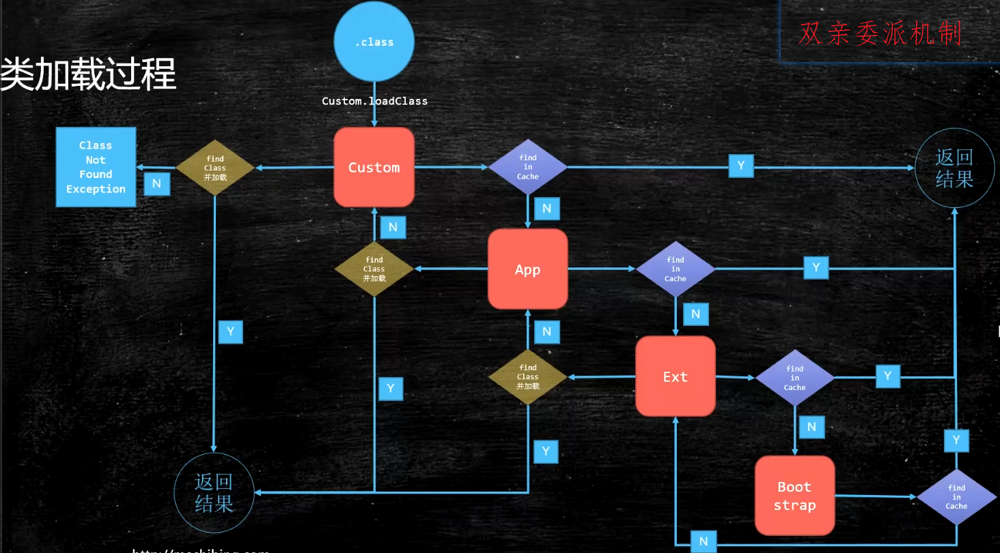
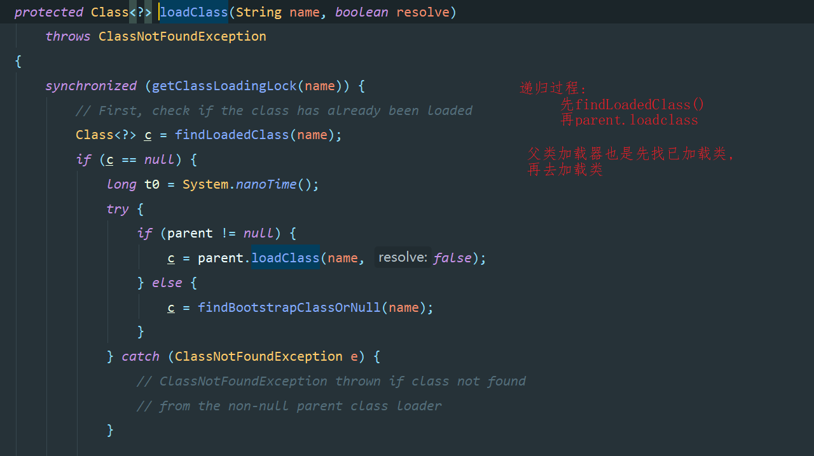
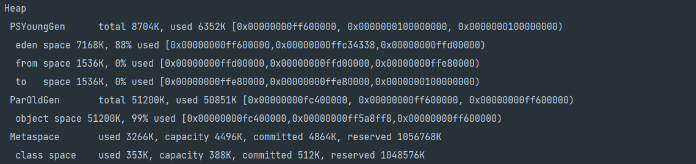

# JVM学习笔记总结

## 1. JVM基础

1. java从编码到执行

   


## 2. 类加载(ClassLoader)

### 2.1类加载流程图




### 2.2 类加载详解

#### 2.2.1 loading过程

1. 类加载器: 

   

   

2. 类加载机制: 双亲委派机制

   

   1. .class通过loadClass方法在custom中的cache中找该类, 若未找到, 则在其父加载器app的cache中找, 若未找到在extension中的cache找, 若未找到, 则在bootstrap中的cache找; 任何一步, 若找到了则返回 

   2. 若bootstrap中未找到, 让extension加载, 若extension没有, 则让app加载, 若没有, 则让customclassLoader加载, 若仍没有 , classNotFind异常

   3. 每个加载器都有缓存

   4. 为什么要双亲委派机制

      - 安全, 双亲委派机制能够保证多加载器加载某个类时，最终都是由一个加载器加载，确保最终加载结果相同。否则被加载类被识别为2个类, 紊乱

   5. 先findLoadClass(name), 再parent.loadClass(name), 递归loadclass()过程, 如果找不到再自己加载(写死了双亲委派机制)

      

3. 为什么用双亲委派机制?

   1. 为了安全, 防止篡改java核心类

4. 如何打破双亲委派机制? 

   1. 重写loadClass()方法, 自定义类加载器

5. 自定义类加载器, 看具体的代码实现


#### 2.2.2 Linking过程

1. verification
   1. 验证文件是否符合JVM规定
2. Preparation
   1. 静态成员变量赋默认值(int: 0  double:0.0)
3. Resolution
   1. 将类、方法、属性等符号引用解析为直接引用


#### 2.2.3 Initializing 初始化过程

1. 调用初始化代码, 给静态成员变量赋初始值


## 3. synchronized实现细节

1. 字节码层面
   1. MONITORENTER  MONITOREXIT 2个监控指令
2. JVM层面
   1. c c++ 调用了操作系统提供的同步机制
3. OS和硬件层面
   1. lock指令


## 4. 调优

### 4.1 常见垃圾回收器组合参数设定：(1.8)

* -XX:+UseSerialGC = Serial New (DefNew) + Serial Old
  * 小型程序。默认情况下不会是这种选项，HotSpot会根据计算及配置和JDK版本自动选择收集器
* -XX:+UseConc<font color=red>(urrent)</font>MarkSweepGC = ParNew + CMS + Serial Old
* -XX:+UseParallelGC = Parallel Scavenge + Parallel Old (1.8默认) 【PS + SerialOld】
* -XX:+UseParallelOldGC = Parallel Scavenge + Parallel Old
* -XX:+UseG1GC = G1
* Linux中没找到默认GC的查看方法，而windows中会打印UseParallelGC 
  * java +XX:+PrintCommandLineFlags -version
  * 通过GC的日志来分辨

* Linux下1.8版本默认的垃圾回收器到底是什么？

  * 1.8.0_181 默认（看不出来）Copy MarkCompact
  * 1.8.0_222 默认 PS + PO


### 4.2 JVM调优第一步，了解JVM常用命令行参数

* JVM的命令行参数参考：http://www.51gjie.com/java/551.html

* HotSpot参数分类

  > 标准： - 开头，所有的HotSpot都支持
  >
  > 非标准：-X 开头，特定版本HotSpot支持特定命令
  >
  > 不稳定：-XX 开头，下个版本可能取消

  java -version

  java -X

  

  试验用程序：

  ```java
  import java.util.List;
  import java.util.LinkedList;
  
  public class HelloGC {
    public static void main(String[] args) {
      System.out.println("HelloGC!");
      List list = new LinkedList();
      for(;;) {
        byte[] b = new byte[1024*1024];
        list.add(b);
      }
    }
  }
  ```

  

  1. 区分概念：内存泄漏memory leak，内存溢出out of memory  
  2. 在服务器上运行时 需要添加java  以及制定的运行方法名 HelloGC
  3. java -XX:+PrintCommandLineFlags HelloGC
  4. java -Xmn10M -Xms40M -Xmx60M -XX:+PrintCommandLineFlags -XX:+PrintGC  HelloGC
     PrintGCDetails PrintGCTimeStamps PrintGCCauses
  5. java -XX:+UseConcMarkSweepGC -XX:+PrintCommandLineFlags HelloGC
  6. java -XX:+PrintFlagsInitial 默认参数值
  7. java -XX:+PrintFlagsFinal 最终参数值
  8. java -XX:+PrintFlagsFinal | grep xxx 找到对应的参数
  9. java -XX:+PrintFlagsFinal -version |grep GC

  ```
  1. -XX:+PrintCommandLineFlags			(打印JVM实际使用的命令行标志及其值)
  执行后的控制台输出: 
  	-XX:InitialHeapSize=266253056  		(堆的初始化大小)
  	-XX:MaxHeapSize=4260048896 			(堆的最大空间)
  	-XX:+PrintCommandLineFlags 			(在启动时打印出JVM实际使用的命令行标志和值)
  	-XX:+UseCompressedClassPointers 	(启用压缩类指针)
  	-XX:+UseCompressedOops 				(启用压缩普通对象指针)
  	-XX:-UseLargePagesIndividualAllocation 	(禁用大页面个别分配)
  	-XX:+UseParallelGC					(使用并行垃圾回收器)
  
  2. -Xmn10M -Xms40M -Xmx60M -XX:+PrintCommandLineFlags -XX:+PrintGC (设置年轻代内存10m 堆最小内存    40m 堆最大内存60m 打印JVM实际使用的命令行标志 输出GC日志)
  执行后的控制台输出:
  	和1类型, 只不过指定了堆的最小和最大空间以及年轻代的初始空间和最大空间
  	-XX:MaxNewSize=10485760 			(年轻代最大空间)
  	-XX:NewSize=10485760				(设置的年轻代空间大小)
  与1. 不同的是增加了GC日志, 摘取记录详解
       YGC 内存分配失败产生的YGC   垃圾回收前后的内存使用情况
  	[GC (Allocation Failure)  27791K->27656K(39936K), 0.0012435 secs]
  	FGC(一次完整的垃圾回收 由JVM自适应调节机制触发)        垃圾回收前后的内存使用情况     
  	[Full GC (Ergonomics)  27656K->27341K(54784K), 0.0080514 secs]
  	FGC(一次完整的垃圾回收 内存分配失败产生的YGC)        垃圾回收前后的内存使用情况     
  	[Full GC (Allocation Failure)  57038K->57020K(59904K), 0.0081851 secs]
  	
  3. -Xmn10M -Xms40M -Xmx60M -XX:+PrintCommandLineFlags -XX:+PrintGCDetails(查看详细的GC日志)	除了有1 2中的内容, 还有heap dump部分如下图, 截取其中一句分析
      eden space 7168K, 88% used [0x00000000ff600000,0x00000000ffc34338,0x00000000ffd00000)
               后面的内存地址指的是，起始地址，			使用空间结束地址，		整体空间结束地址
  
  	
  ```
  
  


### 4.3 调优前的基础概念：

1. 吞吐量：用户代码时间 /（用户代码执行时间 + 垃圾回收时间）
2. 响应时间：STW越短，响应时间越好

确地调优的目的是吞吐量还是响应时间


### 4.4 什么是调优？

1. 根据需求进行JVM规划和预调优
2. 优化运行JVM运行环境（慢，卡顿）
3. 解决JVM运行过程中出现的各种问题(OOM)


### 4.5 调优，从规划开始

* 调优，从业务场景开始，没有业务场景的调优都是耍流氓

* 无监控（压力测试，能看到结果），不调优

* 步骤：
  1. 熟悉业务场景（没有最好的垃圾回收器，只有最合适的垃圾回收器）
     1. 响应时间、停顿时间 [CMS G1 ZGC] （需要给用户作响应）
     2. 吞吐量 = 用户时间 /( 用户时间 + GC时间) [PS]
  2. 选择回收器组合
  3. 计算内存需求（经验值 1.5G 16G）
  4. 选定CPU（越高越好）
  5. 设定年代大小、升级年龄
  6. 设定日志参数
     1. -Xloggc:/opt/xxx/logs/xxx-xxx-gc-%t.log -XX:+UseGCLogFileRotation -XX:NumberOfGCLogFiles=5 -XX:GCLogFileSize=20M -XX:+PrintGCDetails -XX:+PrintGCDateStamps -XX:+PrintGCCause
        1. 5个日志文件, 循环使用, 记录GC相关信息
     2. 或者每天产生一个日志文件
  7. 观察日志情况


### 4.6 预调优案例

案例1：垂直电商，最高每日百万订单，处理订单系统需要什么样的服务器配置？

> 这个问题比较业余，因为很多不同的服务器配置都能支撑(1.5G 16G)
>
> 1小时360000集中时间段， 100个订单/秒，（找一小时内的高峰期，1000订单/秒）
>
> 经验值，
>
> 非要计算：一个订单产生需要多少内存？512K * 1000 500M内存
>
> 专业一点儿问法：要求响应时间100ms
>
> 压测！

案例2：12306遭遇春节大规模抢票应该如何支撑？

> 12306应该是中国并发量最大的秒杀网站：
>
> 号称并发量100W最高
>
> CDN -> LVS -> NGINX -> 业务系统 -> 每台机器1W并发（10K问题） 100台机器
>
> 普通电商订单 -> 下单 ->订单系统（IO）减库存 ->等待用户付款
>
> 12306的一种可能的模型： 下单 -> 减库存 和 订单(redis kafka) 同时异步进行 ->等付款
>
> 减库存最后还会把压力压到一台服务器
>
> 可以做分布式本地库存 + 单独服务器做库存均衡
>
> 大流量的处理方法：分而治之


### 4.7 优化环境

1. 有一个50万PV的资料类网站（从磁盘提取文档到内存）原服务器32位，1.5G
   的堆，用户反馈网站比较缓慢，因此公司决定升级，新的服务器为64位，16G
   的堆内存，结果用户反馈卡顿十分严重，反而比以前效率更低了
   1. 为什么原网站慢?
      很多用户浏览数据，很多数据load到内存，内存不足，频繁GC，STW长，响应时间变慢
   2. 为什么会更卡顿？
      内存越大，FGC时间越长
   3. 咋办？
      PS -> PN + CMS 或者 G1
2. 系统CPU经常100%，如何调优？(面试高频)
   CPU100%那么一定有线程在占用系统资源，
   1. 找出哪个进程cpu高（top）
   2. 该进程中的哪个线程cpu高（top -Hp）
   3. 导出该线程的堆栈 (jstack)
   4. 查找哪个方法（栈帧）消耗时间 (jstack)
   5. 工作线程占比高 | 垃圾回收线程占比高
3. 系统内存飙高，如何查找问题？（面试高频）
   1. 导出堆内存 (jmap)
   2. 分析 (jhat jvisualvm mat jprofiler ... )
4. 如何监控JVM
   1. jstat jvisualvm jprofiler arthas top...


### 4.8 解决JVM运行中的问题

#### 一个案例理解常用工具

1. 测试代码：

   ```java
   /**
    * @Description: FULL GC实战案例
    * @Author: Yym
    * @Version: 1.0
    * @Date: 2023-06-02 18:20
    */
   public class _02FullGC_Demo01 {
   
       private static class CardInfo {
           BigDecimal price = new BigDecimal(0.0);
           String name = "张三";
           int age = 5;
           Date birthdate = new Date();
   
           public void m() {}
       }
   
       private static ScheduledThreadPoolExecutor executor = new ScheduledThreadPoolExecutor(50,
               new ThreadPoolExecutor.DiscardOldestPolicy());
   
       public static void main(String[] args) throws Exception {
           executor.setMaximumPoolSize(50);
   
           for (;;){
               modelFit();
               Thread.sleep(100);
           }
       }
   
       private static void modelFit(){
           List<CardInfo> taskList = getAllCardInfo();
           taskList.forEach(info -> {
               // do something
               executor.scheduleWithFixedDelay(() -> {
                   //do sth with info
                   info.m();
   
               }, 2, 3, TimeUnit.SECONDS);
           });
       }
   
       private static List<CardInfo> getAllCardInfo(){
           List<CardInfo> taskList = new ArrayList<>();
   
           for (int i = 0; i < 100; i++) {
               CardInfo ci = new CardInfo();
               taskList.add(ci);
           }
   
           return taskList;
       }
   }
   ```

2. java -Xms200M -Xmx200M -XX:+PrintGC 包名(win上无需设置 也无需带java)

3. 一般是运维团队首先受到报警信息（CPU Memory）

4. top命令查看所有的进程(内存不断增长 CPU占用率居高不)：

   1. 找出cpu占用率较高的进程

5. top -Hp 进程id

   1. 观察对应进程中的线程，哪个线程CPU和内存占比高

6. jps定位具体java进程
   jstack 线程id;  定位线程状况，重点关注：WAITING BLOCKED
   eg.
   waiting on <0x0000000088ca3310> (a java.lang.Object)
   假如有一个进程中100个线程，很多线程都在waiting on <xx> ，一定要找到是哪个线程持有这把锁
   怎么找？搜索jstack dump的信息，找<xx> ，看哪个线程持有这把锁RUNNABLE
   作业：1：写一个死锁程序，用jstack观察 2 ：写一个程序，一个线程持有锁不释放，其他线程等待

7. 为什么阿里规范里规定，线程的名称（尤其是线程池）都要写有意义的名称
   怎么样自定义线程池里的线程名称？（自定义ThreadFactory）

8. jinfo pid 

9. jstat -gc 动态观察gc情况 / 阅读GC日志发现频繁GC / arthas观察 / jconsole/jvisualVM/ Jprofiler（最好用）
   jstat -gc 4655 500 : 每个500个毫秒打印GC的情况
   如果面试官问你是怎么定位OOM问题的？如果你回答用图形界面（错误）
   1：已经上线的系统不用图形界面用什么？（cmdline arthas）
   2：图形界面到底用在什么地方？测试！测试的时候进行监控！（压测观察）

10. jmap - histo 4655 | head -20，查找有多少对象产生

11. jmap -dump:format=b,file=xxx pid ：

    线上系统，内存特别大，jmap执行期间会对进程产生很大影响，甚至卡顿（电商不适合）
    1：设定了参数HeapDump，OOM的时候会自动产生堆转储文件
    2：<font color='red'>很多服务器备份（高可用），停掉这台服务器对其他服务器不影响</font>
    3：在线定位(一般小点儿公司用不到)

12. java -Xms20M -Xmx20M -XX:+UseParallelGC -XX:+HeapDumpOnOutOfMemoryError com.mashibing.jvm.gc.T15_FullGC_Problem01

13. 使用MAT / jhat /jvisualvm 进行dump文件分析
     https://www.cnblogs.com/baihuitestsoftware/articles/6406271.html 
    jhat -J-mx512M xxx.dump
    http://192.168.17.11:7000
    拉到最后：找到对应链接
    可以使用OQL查找特定问题对象

14. 找到代码的问题